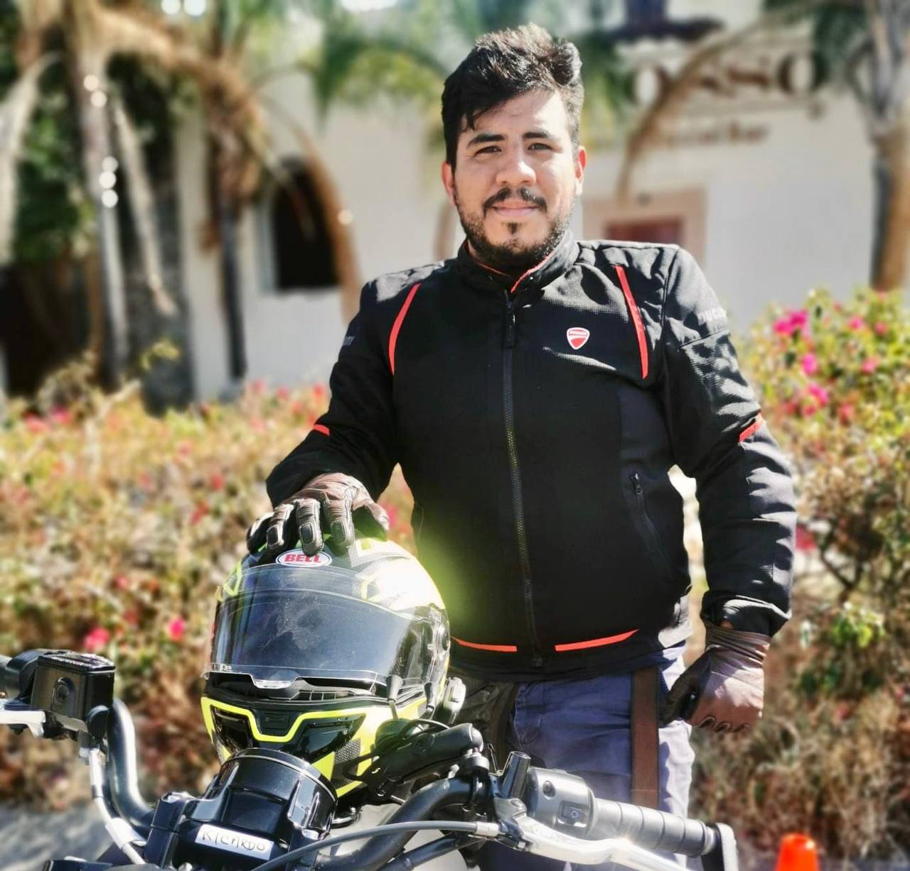

---
hide:
  - navigation
  - toc
---

  

    

      
    

    

      
Software Engineer &middot; Mexico

      <h1 class="hero__name">Ricardo Domenzain</h1>
      

        I build backend systems that stay up: event-driven services, cloud
        infrastructure and the platform tooling that lets teams ship without
        holding their breath. Insurance, banking and intelligent transportation
        taught me what &ldquo;critical path&rdquo; really means.
      

      

        Java
        Python
        Node.js
        .NET
        Kubernetes
        Kafka
        AWS
        Azure
      

      

        <a class="md-button md-button--primary" href="knowledge/">Read my experience &rarr;</a>
        <a class="md-button" href="technologies/">Tech stack</a>
        <a class="md-button" href="https://github.com/rdomenzain">GitHub</a>
      

    

  

## What I work on

-   :material-server-network:{ .lg .middle } **Backend engineering**

    ---

    Critical, high-security systems for insurance and banking — data integrity,
    transaction throughput and scalability as first-class requirements, not
    afterthoughts.

    [:octicons-arrow-right-24: Languages I use](technologies/languages.md)

-   :material-transit-connection-variant:{ .lg .middle } **Event-driven architecture**

    ---

    Apache Kafka and RabbitMQ in production: cluster setup, Connect, Schema
    Registry, KSQL and ACLs wired into microservice architectures.

    [:octicons-arrow-right-24: Platforms](technologies/platforms.md)

-   :material-kubernetes:{ .lg .middle } **Cloud & Kubernetes**

    ---

    Deploying and operating workloads on AWS and Azure, orchestrated with
    Kubernetes — from service configuration to scaling and rollout strategy.

    [:octicons-arrow-right-24: Cloud](technologies/cloud.md)

-   :material-infinity:{ .lg .middle } **DevOps & observability**

    ---

    Pipelines with GitHub Actions, GitLab CI and Jenkins; Docker everywhere;
    Grafana, Prometheus and Thanos so problems surface before users notice.

    [:octicons-arrow-right-24: DevOps](technologies/devops.md)

## A little context

I'm a software engineer from Mexico with a strong backend background. I like
learning things on my own, and I like sharing what I learn even more — most of
what I know came from someone else being generous with their time.

!!! info "Why this site exists"
    Sharing knowledge is part of my growth. :raised_hands_tone3: This is where I
    keep notes on the tools and platforms I actually use, so they're useful to
    someone other than me.

## Beyond the keyboard

-   :motorcycle:{ .lg .middle } **Motorcycles**

    ---

    The best debugging happens somewhere between two curves and the next town.

-   :airplane:{ .lg .middle } **Travel**

    ---

    Whenever work allows it. New places, new food, questionable timezones.

-   :clapper:{ .lg .middle } **Series & movies**

    ---

    My favorite hobby, and an endless source of quotes I use far too often.

-   :musical_note:{ .lg .middle } **Music & podcasts**

    ---

    Usually playing while I work. Prog rock has an unfair share of the queue.

!!! quote ":dragon_face: Game of Thrones"
    I'm not questioning your honor, Lord Janos. I'm denying its existence.

    -- <cite>Tyrion Lannister</cite>

!!! quote ":musical_score: The Dark Side of the Moon"
    Ticking away the moments that make up a dull day, fritter and waste the
    hours in an offhand way...

    -- <cite>Pink Floyd — Time</cite>

## Get in touch

Happy to talk about backend architecture, event-driven systems, or a project
you think I'd enjoy.

[:fontawesome-brands-linkedin: LinkedIn](https://linkedin.com/in/rdomenzain){ .md-button .md-button--primary }
[:fontawesome-brands-github: GitHub](https://github.com/rdomenzain){ .md-button }
[:fontawesome-brands-x-twitter: X / Twitter](https://twitter.com/rdomenzainm){ .md-button }
